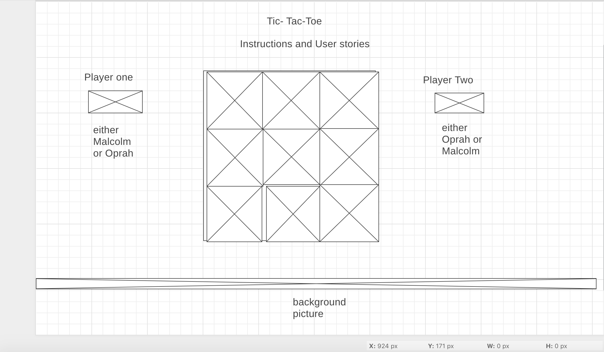

# Tic-Tac-Toe-Game
Hi, I'm a moderately young, creative, and up & coming full stack Web Developer in the making. My name is Tiwana Jones. I decided to use the Iconic Malcolm X and Oprah Winfrey as the player one and player two in my rendition of the Tic Tac Toe game because of the obvious X and O in their name. I always wanted to know how a conversation between the two would go. Although I respect and admire both greatly, I never agreed with either fully. I have a dual nature as a Gemini in the zodiac ,therefore, let the games begin.

User stories
- The user of this Tic-Tac-Toe game rendition will enjoy the ability to play as one of two cultural icons; either Malcolm X or Oprah Winfrey.
- The user that plays as Malcolm X knows that X marks the spot in order to win.
- The user that plays as Oprah will counter or challege  Malcolm's hypothesis with an "Oh, Really?!", for the the win.
-  The Oprah player adheres to the Beyonce' philosophy , believing that women run the world ,and as that user, "Oh what a feeling world domination brings!"
-  The Malcolm X users believe in the Xpanse/expanse of patriarchy, planting their X flag every where the user may strategicly choose to go.

The technologies

 I implemented a grid, For loops, addEventListerners , a Wireframe, CSS, Html,  and Javascript to bring my version of the game to fruition. Along with a couple of locally stored images. I chose not to use a box to alert the winner; instead I wanted the message displayed right on the game.  

I chose to also incorporate the Pan-African Flag. The three Pan-African colors on the flag represent: red: the blood that unites all people of Black African ancestry, and shed for liberation; black: black people whose existence as a nation, though not a nation-state, is affirmed by the existence of the flag; and. green: the abundant natural wealth of Africa.

[The Mother land](https://medium.com/@SamanthaXADOS/red-black-and-green-the-african-liberation-flag-and-the-meaning-behind-it-7dd06fb8e6cf)

what's left?
well, In the future I may add some sounds, a timer, confetti with ballons and change the text font of the X's and O's. I wanted Oprah saying "You get a car, and you get a car", or “You can have it all. Just not all at once.” I wanted Malcolm X  when prompted to say "You need some action!", "We didn't land on
Plymouth Rock" and "Who taught you to hate yourself!".

[Without further ado...My Game!](file:///Users/tiwanajones/sei/projects/project1/Tic-Tac-Toe-Game/index.html)